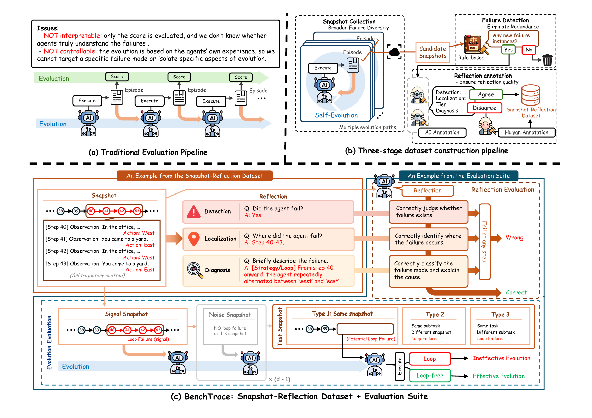

# BenchTrace Code

This repository contains the code for **BenchTrace**, a benchmark for evaluating self-evolution ability in LLM agents.
BenchTrace consists of a snapshot-reflection dataset of 1,821 annotated episodes spanning six tasks, paired with two evaluation suites: Reflection Evaluation and Evolution Evaluation.

📊 **Dataset:** [huangjh16/BenchTrace on Hugging Face](https://huggingface.co/datasets/huangjh16/BenchTrace)



## Repository Structure

```
benchrogue_code/
├── data_generation/        # Dataset construction pipeline
├── evaluation/
│   ├── reflection/         # Reflection Evaluation
│   └── evolution/          # Evolution Evaluation
└── analysis/               # Analysis and plotting scripts
```

Each of the three top-level modules contains a subdirectory per task:
- `jericho` — Jericho text adventure games
- `alfworld` — ALFWorld embodied household tasks
- `babyai` — BabyAI grid-world navigation
- `bundled_web_shopping` — Bundled Web Shopping
- `group_travel_planning` — Group Travel Planning
- `science_world` — ScienceWorld

## Requirements

Install dependencies:
```bash
pip install -r requirements.txt
```

An `api_key.json` file is required in the root directory with the following format:
```json
{"openai": "<your-openai-key>", "anthropic": "<your-anthropic-key>"}
```

## Modules

### 1. `data_generation/`

Scripts for constructing the BenchTrace snapshot-reflection dataset.

| Script | Description |
|---|---|
| `annotate_episodes.py` | Collect raw episodes from agent runs (Jericho only) |
| `format_draft.py` | Generate rule-based draft annotations from episodes (Jericho only) |
| `ai_annotate.py` | Run AI annotators (Claude Sonnet + Gemini Flash) to produce failure annotations |
| `build_dataset.py` | Assemble the final dataset from AI and human annotations |
| `compute_agreement.py` | Compute inter-annotator agreement between AI annotators |
| `annotation_ui.py` | Web UI for human annotation and adjudication (Jericho only) |
| `prompts/` | Task-specific annotation prompt for the AI annotator |

**Usage (example for Jericho):**
```bash
python data_generation/jericho/ai_annotate.py
python data_generation/jericho/build_dataset.py
```

### 2. `evaluation/`

#### `evaluation/reflection/`

Scripts for running and scoring Reflection Evaluation — measuring whether a model can correctly answer detection, localization, and diagnosis questions given an episode snapshot.

| Script | Description |
|---|---|
| `run_reflect_task.py` | Run reflection evaluation on a dataset split |
| `score_reflect_task.py` | Compute per-question metrics (Accuracy, Jaccard, Token F1, LLM-Judge) |
| `llm_judge.py` | LLM-as-judge scoring for diagnosis |
| `cascade_analysis.py` | Cascade (funnel) analysis across detection → localization → diagnosis |
| `prompts/` | Task-specific prompts for all three questions |

**Usage:**
```bash
python evaluation/reflection/jericho/run_reflect_task.py --model Qwen/Qwen3-32B
python evaluation/reflection/jericho/score_reflect_task.py
```

#### `evaluation/evolution/`

Scripts for running and scoring Evolution Evaluation — measuring whether an agent avoids a target failure instance after being exposed to relevant past snapshots.

Baselines included:

| Script | Baseline |
|---|---|
| `run_non_evolution.py` | ReAct (no evolution) |
| `run_naive.py` | Naive (full history concatenation) |
| `run_evotest.py` | EvoTest |
| `run_reflexion.py` | Reflexion |
| `run_remem.py` | ReMemory |
| `run_rag.py` | RAG |
| `run_memrl.py` | MemoryRL |
| `run_autoskill.py` | AutoSkill |
| `run_agentR.py` | Agent-R (Jericho only) |
| `score_evol_eval.py` | Compute score and FAR across all results |

**Usage:**
```bash
python evaluation/evolution/jericho/run_evotest.py --game balances --model Qwen/Qwen3-32B
python evaluation/evolution/score_evol_eval.py
```

### 3. `analysis/`

Scripts for reproducing figures and analysis results in the paper.

| Script | Description |
|---|---|
| `plot_cascade_crossenv.py` | Figure 2: funnel analysis across all six tasks |
| `cascade/plot_cascade_<task>.py` | Per-task funnel breakdown |
| `correlation_analysis.py` | Table 9: FAR conditioned on cumulative reflection correctness |
| `cumulative_funnel.py` | Cumulative funnel statistics |
| `funnel_corr.py` | Correlation between funnel levels and FAR |
| `all_correct_corr.py` | FAR for fully correct reflections |
| `detection_corr.py` | Detection-level correlation analysis |
| `strategy_corr.py` | Strategy failure correlation analysis |

**Usage:**
```bash
python analysis/plot_cascade_crossenv.py
python analysis/correlation_analysis.py
```

## Citation

```bibtex
@inproceedings{benchrogue2026,
  title     = {BenchTrace: Benchmarking Self-Evolution in LLM Agents},
  booktitle = {Proceedings of ACL},
  year      = {2026}
}
```
